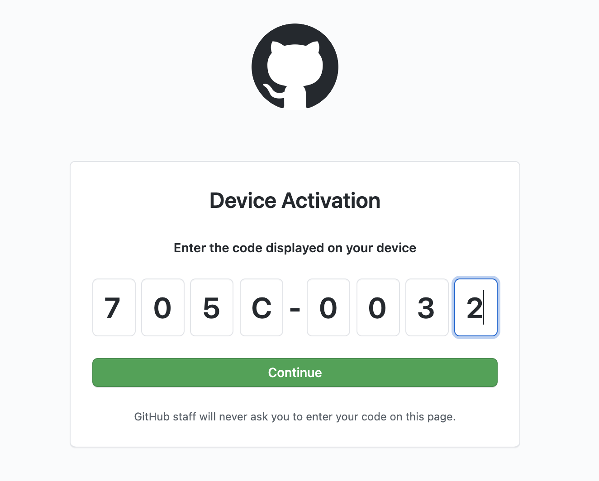

# CLI

## Installation

### MacOS

```bash
brew tap alantech/homebrew-core
brew install anycloud
```

For Linux and Windows it is recommended to install AnyCloud via the [published artifacts](https://github.com/alantech/anycloud/releases/latest). Simply download the zip or tar.gz file for your operating system, and extract the `anycloud` executable to somewhere in your `$PATH`, make sure it's marked executable \(if not on Windows\), and you're ready to roll.

### Linux

```bash
wget https://github.com/alantech/anycloud/releases/latest/download/anycloud-ubuntu.tar.gz
tar -xzf anycloud-ubuntu.tar.gz
sudo mv anycloud /usr/local/bin/anycloud
```

### Windows PowerShell

```bash
Invoke-WebRequest -OutFile anycloud-windows.zip -Uri https://github.com/alantech/anycloud/releases/latest/download/anycloud-windows.zip
Expand-Archive -Path anycloud-windows.zip -DestinationPath C:\windows
```

## Authentication

Authentication in the CLI occurs via GitHub. Make sure you are logged in.

```bash
✔ Press Enter to authenticate the AnyCloud CLI via GitHub
! First copy your one-time code: 21BD-C2D7
✔ Press Enter to open github.com in your browser
```



Copy the code, paste it into github.com and authorize the AnyCloud app before returning to the terminal!