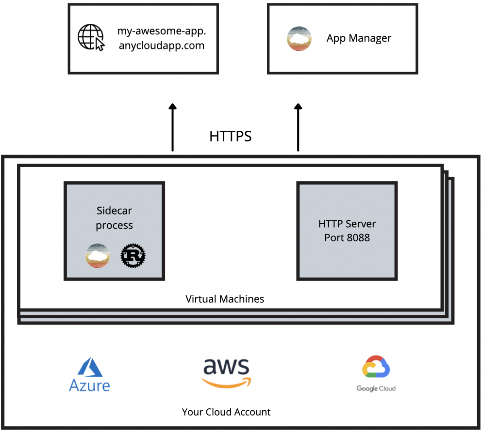

AnyCloud is built for performance on the [Rust](https://rust-lang.org) and [Alan](https://alan-lang.org) programming languages. It is accessed via a CLI that takes cloud provider credentials and a `Dockerfile` with a HTTP server listening on port `8088` as input. Your container/server is deployed to virtual machines in the account with the specified credentials and runs with a sidecar process that proxies requests into the HTTP server. 

## HTTPS

All anycloud apps get their own subdomain with HTTPS such as `https://my-awesome-app.anycloudapp.com` and all traffic, including HTTP requests across virtual machines in the same region, occur over HTTPS. 

## Autoscaling

The AnyCloud sidecar process adds, or removes, virtual machines to your application based on request load and cpu utilization. The sidecar process uses DNS to know which virtual machines are part of each app and route requests internally which allows for apps to be deployed across multiple regions or cloud providers.
