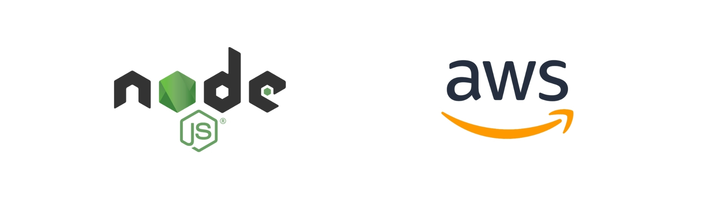

In this tutorial we will deploy the [sample express Node.js HTTP server](https://expressjs.com/en/starter/hello-world.html) in your own AWS account with AnyCloud. All the code can be found in this [template repository](https://github.com/alantech/hello-anycloud) which you can use to [create a new repository](https://docs.github.com/en/github/creating-cloning-and-archiving-repositories/creating-a-repository-from-a-template) for your AnyCloud project.

## Enable programmatic AWS access to VMs for AnyCloud

1) Create a new IAM user in your AWS account using their console/UI as described [here](https://docs.aws.amazon.com/IAM/latest/UserGuide/id_users_create.html#id_users_create_console).

2) Create a new access key under that IAM user using their console/UI as described [here](https://docs.aws.amazon.com/IAM/latest/UserGuide/id_credentials_access-keys.html#Using_CreateAccessKey).

3) Enable programmatic access for that IAM user, and attach the built-in [`AmazonEC2FullAccess`](https://console.aws.amazon.com/iam/home#/policies/arn%3Aaws%3Aiam%3A%3Aaws%3Apolicy%2FAmazonEC2FullAccess)policy to it as described [here](https://docs.aws.amazon.com/IAM/latest/UserGuide/access_policies_manage-attach-detach.html#add-policies-console).

4) Take the `accessKeyId` and `secretAccessKey` from step 2 and create AWS `Credentials` stored locally at `~/.anycloud/credentials.json` only.


You will need to pick a name or alias for the `Credentials`. The default value will be `aws`. In this example, we will call it `mystartup-aws`.


```bash
$ anycloud credentials new
? Pick cloud provider for the new credentials ›
❯ AWS
  GCP
  Azure
Name for new Credentials: mystartup-aws
AWS Access Key ID: ******************
AWS Secret Access Key: ******************
Successfully created "mystartup-aws" Credentials
```

## Configure your project

1) Initialize a `git` repository

```bash
git init
git add -A
git commit -m "Initial commit"
```

2) Initialize your `package.json` and install `express`

```bash
npm init
npm install express --save
```

3) Define an HTTP server listening on port `8088` in an `index.js` file

```javascript
const express = require('express')
const app = express()
const port = 8088

app.get('/', (req, res) => {
  res.send('Hello World!')
})

app.listen(port, () => {
  console.log(`Example app listening at http://localhost:${port}`)
})
```

4) Define the `Dockerfile`

```bash
FROM node:lts

COPY . .

RUN npm install
CMD node index.js
```

5) Test the `Dockerfile` locally by installing [Docker Desktop](https://www.docker.com/products/docker-desktop), building the Docker image and then running the server within the container

```bash
$ docker build -t anycloud/app .
$ docker run -p 8088:8088 -d anycloud/app:latest
$ curl localhost:8088
```

Which should return `Hello World!`

6) Use the AnyCloud CLI to create an `anycloud.json` file in the project directory and define a `Deploy Config`.


You will need to pick a name, or alias, for the `Deploy Config`. The default value will be `staging`. You will also need to associate `Credentials` to this `Deploy Config`.


```bash
$ anycloud config new
? Name for new Deploy Config › staging
? Pick Credentials to use ›
❯ mystartup-aws
  Create new Credentials
? Do you want to choose a specific region for this Deploy Config? › y
? Region name › us-east-1
? Do you want to select which virtual machine type to use for this Deploy Config? › y
? Virtual Machine Type › m5.large
? Do you want to add another region to this Deploy Config? › n
? Minimum number of VMs per region or cloud › 1
? Would you like to define a maximum number of VMs? › n
Successfully created "staging" Deploy Config.
```

7) Make sure all of the changes in the git repo are committed or they won't be deployed.

## Deploy an App

1) Make sure you [installed the AnyCloud CLI](about.md#cli-installation). Now deploy your Node.js server to your AWS account using the AnyCloud CLI.

```bash
$ anycloud new
? Pick Deploy Config for App ›
❯ staging
? Optional App name ›
▇ Creating new App
```

It might take a few minutes for your App to start while the virtual machine is provisioned and upgraded. The AnyCloud CLI will generate a random App name for you, but [a custom app name can be used](how-to/custom-app.md).


2) Check the status of your App:

```bash
$ anycloud list
Apps deployed:

┌────────────────┬───────────────────────────────────────┬───────────────┬──────┬────────┐
│ App ID         │ Url                                   │ Deploy Config │ Size │ Status │
├────────────────┼───────────────────────────────────────┼───────────────┼──────┼────────┤
│ crimson-tick-5 │ https://crimson-tick-5.alandeploy.com │ staging       │ 1    │ up     │
└────────────────┴───────────────────────────────────────┴───────────────┴──────┴────────┘

Deploy Configs used:

┌───────────────┬───────────┬───────────┐
│ Deploy Config │ Region    │ VM Type   │
├───────────────┼───────────┼───────────┤
│ staging       │ us-east-1 │ m5.large  │
└───────────────┴───────────┴───────────┘

```

3) The `size` of your App represents the number of virtual machines used to back your App. Apps scale elastically based on request load automatically. Now `curl` your AnyCloud App!

```bash
$ curl https://crimson-tick-5.anycloudapp.com
```

Which should return `Hello World!`

4) Terminate your AnyCloud App when you no longer need it

```bash
anycloud terminate
? Pick App to terminate ›
❯ crimson-tick-5
```
