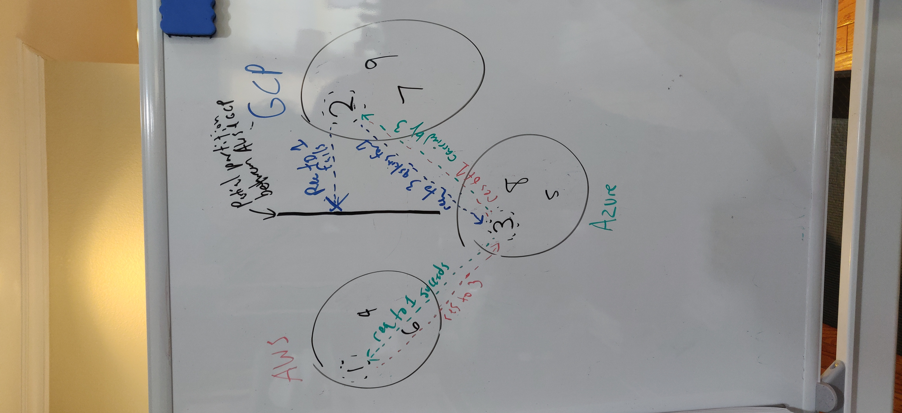
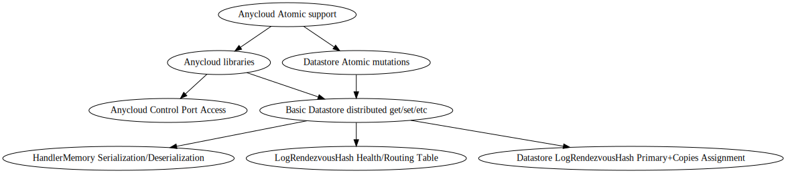

# 017 - Cluster Data Storage RFC

## Current Status

### Proposed

2021-03-31

### Accepted

YYYY-MM-DD

#### Approvers

- Luis De Pombo <luis@alantechnologies.com>
- Alejandro Guillen <alejandro@alantechnologies.com>

### Implementation

- [ ] Implemented: [One or more PRs](https://github.com/alantech/alan/some-pr-link-here) YYYY-MM-DD
- [ ] Revoked/Superceded by: [RFC ###](./000 - RFC Template.md) YYYY-MM-DD

## Author(s)

- David Ellis <david@alantechnologies.com>

## Summary

Building on RFCs 8 and 13, implementing a cross-cluster global datastore makes mutable state simple and reliable for Alan and Anycloud application. It also opens the door for various intra-cluster compute algorithms to be built on top of it, such as cron jobs, sub-cluster capability flags, queues, and etc. Two things required to make all of this possible: cross-cluster coordination and the ability to atomically mutate multiple keys in the datastore together.

## Expected SemBDD Impact

This would be a minor update to the language if we were post 1.0. The features described are additive to the language, and is the first piece to realize the vision of the entire cluster of computers as a single logical entity from the perspective of the developer and programming language.

## Proposal

### Dependencies of this RFC

Before work on this RFC can begin, the first part of RFC 13 needs to be implemented to make sure unsafe casts are impossible, so it can be relied upon by developers instead of being a potential footgun.

### Proposal Overview

The entirety of this work lives within the AVM and technically does not change the accessible APIs of the language. It simply fixes the issue that at this time, `@std/datastore` does not share its stored data between instances within the same cluster.

Already within the AVM are two foundational pieces that will be integrated with datastore when in `daemon` mode:

1. LogRendezvousHash to determine what the top `n` nodes are that are assigned the owners of a particular piece of data, with the top node assigned the ability to mutate the data.
2. The HTTPS and secret token guarded control port, which can be used by the `deploy` service, the nodes of the cluster itself, or the `Anycloud` app to query a particular node for information, such as its status.

We can integrate these two concepts to enable automatic assignment of which nodes will receive the `@std/datastore` key-val pair, and which node will be involved in handling mutations of that data. The control port must have new endpoints that the nodes use to coordinate and pass this data around, and the control port (and these endpoints) can be exposed to the `Anycloud` docker container to enable non-Alan languages to gain the benefit of this automatic, self-healing distributed cache.

This can be broken into multiple tasks:

* Creating the endpoints and the serialization/deserialization of the HandlerMemory necessary
* Querying LogRendezvousHash for the first node to know which one is "in charge" of this data, or the first `n` nodes if it is itself so it knows where to push the mutation to
* Fronting the datastore internal data structure with this logic instead of using it directly by the opcodes (when in daemon mode, leaving it as-is or having a "cluster" of one when running locally)
* Exposing this new behavior into the docker container, and the library work necessary to make this feature usable and natural in other languages.
* Adding atomic functionality to the datastore API and internals to make distributed mutation (not just key replacement) possible

### Cluster Coordination Work

The new endpoints have some extra logic that they need to tackle, as this is the first time the nodes of the cluster are actually communicating with each other. The LogRendezvousHash module needs to be updated on the *actual* state of the cluster versus the expected state defined in the DNS records: which nodes are actually up or down from its perspective? That determines which nodes are considered for ownership of the datastore data. RendezvousHash (and our own LogRendezvousHash) are stable, in that the top `n` nodes after one of them goes down will still contain `n - 1` of the original set, so not too much data thrashing occurs when a node goes down or comes online.

Further, while a full network partition between two groups of nodes will result in a "split brain" scenario in an unavoidable fashion, with LogRendezvousHash it is possible to counteract a partial split by way of a request forwarding mechanism. If a node cannot directly reach another node, it should try to ask all other nodes in its list if any of them can reach the node. If so, the first one to respond in the positive becomes the new "router" that all requests to that node are forwarded through, with periodic attempts in the background to remove the extra hop by re-polling. Only if all nodes a node can reach report that they also cannot reach the node in question should it be marked as "down" and assignment of keys shuffled with the new, reduced set. This is fundamentally how the internet routes packets to unknown MAC addresses, and can guard against misconfigured firewalls/routers black hole-ing packets that they shouldn't be, but only works when there is an unaffected third party, so requires at least three separate sub-clusters to work.

For example, let's presume a cluster has been deployed to all three major cloud providers: AWS, Azure, and GCP. Now let's presume that GCP has a network configuration error that makes AWS nodes unreachable to it and vice versa. When the GCP nodes want to get data that was previously assigned to AWS, they will fail to contact the AWS node, then try to ask all other nodes (which would include the other AWS nodes) which ones can reach the AWS node in question. The GCP nodes would report a failure, but the Azure nodes would report a success, and one of those nodes will be chosen effectively at random to be the node that will route to the AWS node. This process would repeat across every GCP node and AWS node combination with an effectively random assignment of Azure nodes to handle the load, which should lead to an approximately even level of traffic distribution between the Azure nodes.



This all can be contained in a relatively simple `/ping/<public_ip_address>` control port endpoint. Normally the `/ping/<public_ip_address>` would be directed at `<public_ip_address>`, which should always return `ok` (as long as the cluster secret token is also provided as a header, otherwise `fail`, but that's at an earlier part of the control port implementation). But if a request for `/ping/<public_ip_address>` comes in and `<public_ip_address>` is not the node's own public IP address, then it immediately forwards the request on to the public IP address in the request URL and returns its response or `fail` if it times out (should be a short timeout as well, such as 50ms, but exact threshold depends on real world data here).

The datastore node API should work similarly but at a higher level. The node determines based on LogRendezvousHash which node should own the namespace+key pair in question, then it fires that request to the *appropriate* node, which is the node in question under normal circumstances but if the internal bookkeeping of node routing has an intermediary node listed, it goes to that node instead. When handling a request for the data, the node receiving the request hashes the namespace+key pair and determines if it is the correct node for the job or if it should forward that request to another node, which will make this process seamless.

This exact functionality can be automatically used by the `Anycloud` app by just requesting something like `/datastore/has/<namespace>/<key>` to the local instance and being sure that it will forward along the request to the correct node, or the local instance happens to actually own that data and handles it itself.

Providing the cluster secret string into the Docker container as an environment variable along with the 4142 port is the other piece that makes it possible, and these requests can be put into a simple library for the language the Anycloud app is written in to cover up these implementation details and make it fit in better with the language in question.

But those endpoints make clear something else that's necessary: the `HandlerMemory` structs that represent the value of a particular key need to be able to be serialized and deserialized, and in a way that they can be done so not just in Rust, but any language we want to fully support in Anycloud. (That's not entirely correct, we could create a set of secondary endpoints just for Anycloud that only accepts strings, or rather `Array<int8>` arrays where strings are a special case of that, but that may limit/impede future efforts at RPC between the Alan and Anycloud for offloading CPU-intensive work to Alan, and we still need serialization/deserialization of HandlerMemory for Alan itself.)

Since all nodes in a cluster will be running the same version of Alan, which means they all have the same HandlerMemory, [protobuf](https://github.com/protocolbuffers/protobuf) is the best solution here for speed, size, and compatibility concerns, as it officially supports many languages and there is also a [Rust implementation](https://docs.rs/protobuf/2.22.1/protobuf/) that can be used. There are other protocols that are more widespread (JSON), faster (CapnProto), and smaller (Serde), but Protobuf hits a sweet spot where it's decent at all three (and it isn't an Apache project monstrosity, will veto any push for something out of apache.org).

### Global Mutable State that Actually Works

In many cases where `@std/datastore` is simply used as a cache, we are done, but in any case where one or more keys need to have their value mutated, not just replaced, we need a way to atomically perform that mutation so we're sure that other places where a similar mutation could be occurring simultaneously don't accidentally obliterate the work we are doing.

To be clear, this vulnerability affects `@std/datastore` as it currently exists even without the state being distributed across a cluster. It's just harder to hit when the latencies are lower when completely local. The traditional approach of locks on shared mutable state, besides being complicated to follow for many developers, also becomes a performance bottleneck when the locks are distributed across a cluster and lock acquisition and release times are several orders of magnitude slower. For this reason, an approach based on Software Transactional Memory (STM) is the choice to handle mutation of one-or-more datastore keys.

Because STM re-runs the code involved in a mutation of memory, side-effects can be triggered multiple times. If one of those "side-effects" is billing a customer through Stripe, for instance, that would be a *very* bad thing to do automatically without any indication to the user! Also because the STM behavior increases the total latency to perform a mutation (as it needs to confirm that all writes are good before committing them, more on that algo later) being able to escape that behavior when using datastore as just a cache is also desireable.

Combine these two needs together and the STM behavior needs to be an opt-in use by the developer because possible race conditions vs side-effect repetition is a trade-off and being explicit here is better than implicit. This will make it clear what block of code may be run multiple times until the mutation succeeds.

A goal of this work is to make it possible to build SQL-like tables on top of datastore, both for the niceties of being able to do ranged queries on sets of data and to provide a solid foundation with known semantics to the user. For example:

```ln
from @std/datastore import atomic, namespace, getOr, set

type User {
  id: int64,
  firstName: string,
  lastName: string,
  email: string,
}

type FirstNameIndex = KeyVal<string, int64>
type LastNameIndex = KeyVal<string, int64>
type EmailIndex = KeyVal<string, int64>

export fn addUser(firstName: string, lastName: string, email: string): Maybe<Error> {
  return atomic(fn {
    const userTable = namespace('userTable');
    const id = userTable.getOr('userTableLength', -1);
    if id == -1 {
      return some(err('Could not get user table length?'));
    }
    let firstNameIndex = userTable.getOr('firstNameIndex', new Array<FirstNameIndex> []);
    firstNameIndex.push(new FirstNameIndex {
      key: firstName,
      val: id,
    }).sort();
    let lastNameIndex = userTable.getOr('lastNameIndex', new Array<LastNameIndex> []);
    lastNameIndex.push(new LastNameIndex {
      key: lastName,
      val: id,
    }).sort();
    let emailIndex = userTable.getOr('emailIndex', new Array<EmailIndex> []);
    emailIndex.push(new EmailIndex {
      key: email,
      val: id,
    }).sort();
    const record = new User {
      id: id,
      firstName: firstName,
      lastName: lastName,
      email: email,
    }
    userTable.set(id.toString(), record);
    userTable.set('firstNameIndex', firstNameIndex);
    userTable.set('lastNameIndex', lastNameIndex);
    userTable.set('emailIndex', emailIndex);
    userTable.set('userTableLength', id + 1 || -1);
  })
}
```

There are performance issues with this particular approach (the incrementing ID field means that the construction of the record goes hand-in-hand with creating the record, which can slow things down and reduce the maximum possible throughput of the cluster to `1 / runtime of this function` (so a runtime of `100ms` to create this data means you can only insert 10 records per second for the entire cluster, regardless of the size of the cluster). This can be avoided by having distributed [threadsafe queues](https://docs.oracle.com/javase/7/docs/api/java/util/concurrent/ConcurrentLinkedQueue.html) if there's a tolerance for inserted records to not be immediately queryable. Then that queue can be consumed multiple records at a time to generate the index updates out-of-band, making insertion scalable with the cluster size and pushing the maximum indexes / sec much higher, but with eventually consistent semantics instead of fully ACID-compliant (so it could also make sense to make both options available for users to choose from).

Regardless, the way that the `atomic` mechanism would work is that all datastore reads would go out to the cluster as normal, but internally it holds on to the original key-val pair and provides the value as a copy to the Alan code. All writes out are intercepted in this atomic mode and held in the same memory as the read copies are stored. Once the closure has finished running, the atomic function's opcode tries to commit the changes across the cluster. If successful it returns a `none` value for the `Maybe<Error>`, otherwise it re-runs the underlying function again until it eventually hits a maximum execution limit. There would be a default number of runs (3?) that could be overridden by with a second form of the function with two arguments, the other being a `Seq` object to consume (the 1-arg version would just construct such a `Seq` object internally and immediately consume it).

The algorithm for atomically updating the fields at the end of the run is based on the TCP SYN-ACK algorithm. The node that is doing the mutation will send the original and new version of each key that was mutated during the `atomic` call (any key that was read but not written to does not count) to the nodes in charge of said keys. They will respond with either a `fail` error or a random key indicating success. At this point, the nodes really do lock for a very brief period of time. The mutating node, if all keys come back successful, responds back with the key and `ok`, otherwise it responds only to the nodes that succeeded with the key and `fail` to unlock them or commit the changes. This depends on the response times of every node, but ideally in the single-millisecond timeframe. In case the node trying to do the mutation fails, all nodes will eventually assume failure and not unlock if enough time has passed, say 100ms.

Finally, this `atomic` functionality can be exposed for `Anycloud` (though not needed for the language itself), by a special endpoint that provides the list of keys to query and the endpoint on the Anycloud app to POST them to, and then that triggers an `atomic` call internally that fetches the required data, POSTs it at the Anycloud app, then takes the response payload and tries to commit them, until success or failure, and finally responds back on the original request with that success or failure. This could be used by things that aren't `Anycloud` so it doesn't seem that bad to have, but it might also be worthwhile to make registering custom control port behaviors from the Alan application possible, and then it could be part of the `anycloud.ln` file.

### Alternatives Considered

There's a massive number of potential alternatives here for the two main sections:

#### Cluster Coordination

1. We could use consistent hashing instead of rendezvous hashing. This was rejected because of how finnicky the consistent hashing-based projects inside Uber were versus the Optima project that we wrote using RendezvousHashing being so rock-solid with comparatively little effort. Consistent Hashing went big because of its usage in BitTorrent with its magnet protocol, and it was chosen there because of its higher tolerance for cluster node addition/removal versus RendezvousHashing. A combination of familiarity, simplicity, and not needing a truly dynamic membership mechanism are why we are going with rendezvoush hashing.
2. We could use something like Zookeeper or Cassandra for shared mutable state and outsource this problem entirely. This could get us going faster for the mutable state situation, but it makes the operational complexity of the AVM much larger and makes the eventual goals of actually distributing compute across the cluster (self-identifying hotspots in the cluster and offloading work, or shifting work to nodes that can better handle said work because of assymmetries in the underlying hardware (CPU vs GPGPU), or splitting a massive array `map` call to `map` calls on multiple machines dealing with subsets of the array simultaneously) much harder to achieve.
3. We could just rely on the existing internet routing logic to get the data between the nodes and not even try to handle a partial split brain scenario, since the internet is *supposed* to do that already, but the extra work to add the improved reliability is not too much higher and the behavior of firewalls and some middle-layer routers on the modern internet violate that original spirit of the internet, so this partial split brain scenario does happen from time to time (listening to the DevOps people at Uber, it seemed like a roughly 1-2 times a year thing in the US where some ISPs just stop being able to talk to *part* of the internet, and a higher rate for other countries). Being able to yawn when such an event occurs seems like something DevOps will at first begrudgingly accept and then enthusiastically expect in the future, and we'll have an advantage over most of the competition on that front.
4. Sharing access to Anycloud apps could be done with something completely separate from the control port, tailored to Anycloud, but that adds more special casing for Anycloud versus other users' apps (which is the opposite direction I would want to head in) and would likely have a large amount of overlap, anyways.

#### Global Mutable State that Actually Works

1. Similar to the above, we could still offload the actual shared mutable state to a shared database, but the operational complexities, the work we'll still need to do for distributed compute, and the lack of control over our own destiny (if a situation falls flat on its face, we will need expertise in whichever database we choose to solve the performance issues a customer is running into, so we are not actually outsourcing any of the risk).
2. Converting `atomic` to use distributed locks instead of STM would eliminate the multiple execution problem, but because the total runtime of the users' code is not known and potentially not-knowable if there is an IO request (HTTP/exec/etc), that means that you can't just time-out the locks, or at least, you can't do it without a very large timeout time, which further compounds the performance impacts of this approach, while the singular locking mechanism required at the end of the STM execution can be kept in the milliseconds range even with the lock timeouts in case of node failure, making it the safer alternative for cluster health as a whole.
3. A completely different model where key ownership is not determined by the cluster but instead the nodes simply register which key is owned by which node with the ability to "take" keys could be used for the `atomic` work by having `atomic` mode try (and wait) for the key it wants to mutate to be reassigned to itself, then perform the mutation (and when another mutation wants the key(s) for mutation it takes them) so there is no cross-cluster coordination of the mutations themselves, but this can lead to very poorly balanced nodes and suffers from a similar problem as the locking approach if multiple parallel `atomic` calls both want the same key. In this case, the first one to claim a key "wins", but you can easily get into a deadlock situation if two similar but different `atomic` calls need the same keys but request them in a different order, neither willing to give it up (until they both timeout and either error or retry). Practically this approach seems nice because it "avoids" remote mutation, but it actually combines the worse qualities of both locks and STM.

## Affected Components

While this has no visible changes to the language besides the new `atomic` function, it will affect all parts of Alan, the standard library, compiler, and runtimes.

## Expected Timeline

I cannot come up with a very accurate timeline. There's a *lot* of work in this RFC. However, there are a bunch of tasks that can be run in parallel, so we can work on the pieces we find interesting or most useful first and build it up over time.



From this graph, we can see that we can work on HandlerMemory Serialization/Deserialization, LogRendezvousHash Health/Routing Table, Datastore LogRendezvousHash Primaries+Copies Assignment, and Anycloud Control Port Access work in parallel. Once the first three of those are done, we can do the basic distributed datastore work, then when that's done we can start work on both the Anycloud libraries we want to support and the atomic datastore functionality. Finally when all of that is done we can add atomic support for anycloud.

Depending on how many people are involved and how fast each of these can go, this can be anywhere from ~2 weeks to ~1 month, I estimate.

