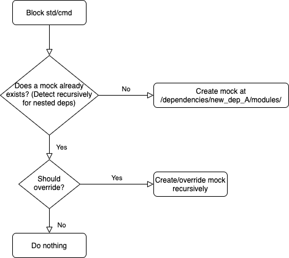
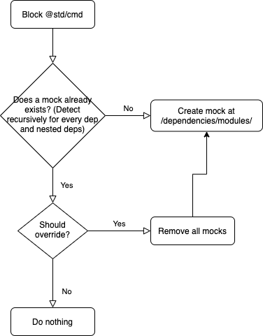

# 020 - Dependencies permissions RFC

## Current Status

### Proposed

2021-08-05

### Accepted

2021-08-11

#### Approvers

- David Ellis <david@alantechnologies.com>
- Luis De Pombo <luis@alantechnologies.com>
- Colton Donnelly <colton@alantechnologies.com>

### Implementation

- [ ] Implemented: [One or more PRs](https://github.com/alantech/alan/some-pr-link-here) YYYY-MM-DD
- [ ] Revoked/Superceded by: [RFC ###](./000 - RFC Template.md) YYYY-MM-DD

## Author(s)

- Alejandro Guillen <alejandro@alantechnologies.com>

## Summary

Alan's third-party module permission system is one of the value propositions of the language. It adds a layer of security no other project approaches. The idea is to allow users to prevent specific third-party dependencies from having access to specific standard libraries that they should not have access to. This can be achieve with current mocking built-in and some updates to the `@std/deps` standard library.

The priorities of the module resoulution system would go as follow starting with the highest priority:

1. Actual dependency level `modules` directory
2. Global dependencies `modules` directory
3. Application `modules` directory

Meaning that inner `modules` > outer `modules`.

## Expected SemBDD Impact

This would be a minor update if we were post-1.0 as it should have zero breaking impact on existing code.

## Proposal

This proposed API takes current module resolution and built-in mock system as an advange. The main goal is to have applications with a **safe-by-default** behavior on install. The result will be an API where users explicitly choose which standard libraries they will be using. Additionally, external libraries can be added and specific blocks will be applied if necessary for each one.

The API will handle the following actions:

- Define which **standard libraries** will be used in the Alan application/library. Will translate in a removal from the "blacklist".

- Define which dependencies or standard libraries will be disabled for all dependencies. Meaning if I'm installing 2 external dependencies, and both of them use `@std/cmd` and I want to block it, I can `disable` `@std/cmd` and will be block for both of them. It will be translated in mocks at `./depeendencies/modules/` level.





- Define which external libraries will be part of the project and we could add specific blocks for dependecies used in the external library.

The `@std/deps` will have the following API:

```ts
type Package {
  std: Array<string>,
  dependencies: Array<Dependency>,
  block: Array<string>,
  fullBlock: Array<string>,
}

type Dependency {
  url: string, // Empty string or ignore it for global blocks at application level
  block: Array<string>,
  fullBlock: Array<string>,  // fullBlock, deepBlock, extensiveBlock, exhaustiveBlock?
  package: Package,
}

event install: Package

fn package(): Package {
  return new Package {
    std: [],
    dependencies: [],
    block: [],
    fullBlock: [],
  };
}

fn use(pkg: Package, std: Array<string>): Package {
  pkg.std = std;
  return pkg;
}

fn dependency(pkg: Package, url: string): Dependency {
  return new Dependency {
    url: url,
    block: [],
    fullBlock: [],
    package: pkg,
  };
}

fn add(dep: Depenency): Package {
  const pkg = dep.pkg;
  pkg.dependencies.push(dep);
  return pkg;
}

fn block(pkg: Package, block: string): Package {
  pkg.block.push(block);
  return pkg;
}

fn block(pkg: Package, block: Array<string>): Package {
  pkg.block = pkg.block + block;
  return pkg;
}

fn block(dep: Dependency, block: string): Dependency {
  dep.block.push(block);
  return dep;
}

fn block(dep: Dependency, block: Array<string>): Dependency {
  dep.block = dep.block + block;
  return dep;
}

fn fullBlock(pkg: Package, block: string): Package {
  pkg.fullBlock.push(block);
  return pkg;
}

fn fullBlock(pkg: Package, block: Array<string>): Package {
  pkg.fullBlock = pkg.fullBlock + block;
  return pkg;
}

fn fullBlock(dep: Dependency, block: string): Dependency {
  dep.fullBlock.push(fullBlock);
  return dep;
}

fn fullBlock(dep: Dependency, block: Array<string>): Dependency {
  dep.fullBlock = dep.fullBlock + block;
  return dep;
}

fn commit(pkg: Package) {
  // Remove std dep from blacklist
  // Download and install each dep
  // Apply blocks defined for each dependency
  // Block/Enable (based on what we finally decide) depenencies at application level, meaning that mocks will exists at /dependencies/modules/
}
```

The `.dependencies.ln` file could look something like:

```ts
on install fn (pkg: Package) = pkg
  .use(['@std/tcp'])
  // Block `@std/cmd` but do not override if any mock exists:
  .dependency('https://github.com/org/new_dep_A')
    .block('@std/cmd')
    .add()
  // Block `@std/cmd` and override mocks if any:
  .dependency('https://github.com/org/new_dep_B')
    .fullBlock('@std/cmd')
    .add()
  // Do not block any standard library:
  .dependency('https://github.com/org/new_dep_C')
    .add()
  // Applying `block` or `fullBlock` at Package level will explicitly block standard library modules for all dependencies
  .block('@std/fs')
  .fullBlock(['@std/exec'])
  .commit();
```

We should take into account that right now this safeguard will exist if the `.dependencies.ln` file exist.

### Alternatives Considered

- The fisrt option is leave it as is and do not provide any built-in feature, letting users do it manually. This is painful.

- The same as the proposed solution but do not look recursively trough nested dependencies. The downside of this is that we still will need to trust third party libraries' authors to ensure their dependencies does not intend malicious activities.

- Every standard library is open to be used and users should bock all the time the necessary standard libraries used on their app. This way users will not be able to know which standard libraries are being used to decide which ones want to block.

## Affected Components

This will mostly affect the standard library.

## Expected Timeline

This should probably only take about a week.
