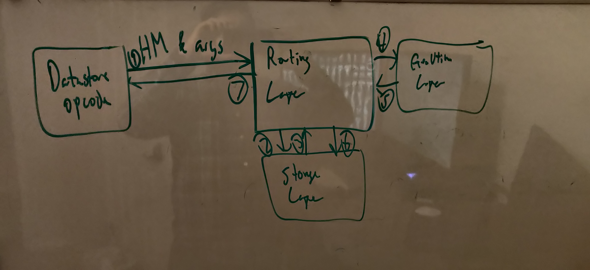

# 021 - Datastore Restructuring RFC

## Current Status

### Proposed

2021-08-12

### Accepted

YYYY-MM-DD

#### Approvers

- Luis de Pombo <luis@alantechnologies.com>
- Alejandro Guillen <alejandro@alantechnologies.com>
- Colton Donnelly <colton@alantechnologies.com>

### Implementation

- [ ] Implemented: [One or more PRs](https://github.com/alantech/alan/some-pr-link-here) YYYY-MM-DD
- [ ] Revoked/Superceded by: [RFC ###](./000 - RFC Template.md) YYYY-MM-DD

## Author(s)

- David Ellis <david@alantechnologies.com>

## Summary

While the API presented to users for `@std/datastore` is solid and only needs minor tweaks, the gradual evolution of the implementation within the AVM has become difficult to follow and maintain, with necessary logic in three distinction locations within the codebase and the dependency on [`dashmap`](https://docs.rs/dashmap/4.0.2/dashmap/struct.DashMap.html) blocking desired functionality in distributed computing by not locking correctly and so needs to be replaced.

## Expected SemBDD Impact

If we were post 1.0.0, this would be considered a patch change to the AVM, as no user-facing changes would be present (unless we decide to go with some of the optional proposals also included, then it would be a minor update).

## Proposal

The AVM's ability to coordinate with its peers and distribute data and compute is a significant cornerstone in the Alan programming language. There are a few things that need to be fixed with the provided API, primarily type safety, but the interface users see is mostly very clean and easy to operate. The implementation that has grown over the past few months, though, is somewhat brittle and difficult to follow, and an unexpected problem with `dashmap` has made the desired locking behavior during remote execution mutations impossible. This last problem has accelerated the need to rework this part of the AVM, though desired functionality like resiliency to network partitions and better key "homing" for clusters distributed around the world will also be unblocked by a refactoring of the datastore and control port codebase.

The datastore code is currently broken across two files in three distinct segments, with dependencies criss-crossing between them. Each AVM node has a `Dashmap` to store the data instantiated as a singleton in `src/vm/opcode.rs` and the datastore opcodes that manipulate it directly if the AVM is running locally, or delegate to the remote implementation stored in `src/daemon/ctrl.rs`. The remote implementation is split into two parts, the control port server endpoints that do the actual work, located at the beginning of the control port file, and the client functions that make requests to another node and determine which node should be spoken to for the data in question, located at the end of the file. The logic for how a datastore opcode is essentially written twice, once inside of the opcode, and once split in two across the client and server code in the control port. This split is also bespoke, with different opcodes using different combinations of HTTP headers, JSON, and Protobuf to communicate back and forth. The various mechanisms were chosen for the simplicity and/or efficiency in the communication between the two nodes, but makes DRYing that layer very difficult. Even if that were solved, also DRYing the implementation between the control port and the opcodes is desirable to reduce the testing overhead involved, as well as making sure improvements to one opcode can be applied to another.

There are multiple logical layers to how any particular datastore opcode functions:

1. Determining which node should perform the operation and contacting it with the relevant parameters.
2. Locking the relevant data entry if mutating the data, executing the required operation, and return the results.
3. Determining which other nodes should store the relevant data if this opcode mutated the data.
4. Storing changed data that was requested to be stored, unlocking afterwards.

This breaks down into routing, execution, and storage layers, where the routing and possibly storage layer can be swapped between local and cluster implementations. We only need the routing layer to be different, though, and we sandwich the execution layer with routing calls on both sides so that layer can handle the replication for us. But leaving the storage layer open to being swappable if we deem it necessary.

The routing layer has primarily three responsibilities:

1. Determining the primary node for mutations or consistent reads, and the closest node for fast eventually consistent reads.
2. Determining all nodes the primary node should replicate to for backup and eventually consistent usage.
3. Redirecting requests incorrectly sent to the node if the other node erroneously identified it (can happen during scale up/down and network partitioning, silent redirection also handles partial partitioning of the cluster.

If we put the routing layer in front of all updates to the storage layer as well, then the execution layer does not need to worry about this, anymore; and can simply do the work asked of it. The execution layer would look more like the local version implementation in `opcode.rs` that way.

For the storage layer, a pattern we used prior at Uber for high volume mutations should work well here: We create a threadpool (actual OS threadpool) and each thread has its own hashmap internally. We decide which keys go to which hashmap very similarly to how we choose which node is primary for a key, with a RendezvousHash-inspired algorithm, so guarantee it always goes to the same location. Since we are basically guaranteed that the number of CPU cores on any given node is static, however, we can make it a simple `xxhash` of the key `modulus` the number of OS threads to identify the thread we want, which is much faster than a true RendezvousHash (designed to handle changes in cluster membership). Access to the data in these OS threads can be done with channels. We can have three channels, two reads and a write, where one read channel provides a token value that must be passed back through the write channel to let the next locking read have access to the data, etc. Since we allow explicit setting of data in datastore, as well, the write channel will accept writes without a token, but obviously any key with both tokenless and token writes will have data race issues. It would be best if we can adjust the API exposed in the standard library to separate those usages from each other.

It may also make sense for the storage layer to get the execution context, as well; then no transferrance of the key in question between OS threads would be necessary and since blocking mutations like that prevent other mutations on the same key from happening simultaneously, that might be a better use of CPU time on these OS threads, as well. But mixing Tokio async/await with real OS threads may be difficult/impossible, or may still require spawning a task with an `async move` block inside, which would nullify the benefits while complicating the storage layer, so we should be careful with this. Likely we don't do something like this in the first pass to make the layers cleaner and more easily extensible, and we come back to it later as an optimization pass when we're more convinced that little will change with datastore's API and the increased maintenance burden is worth it.

The architecture and flow for the proposed datastore is diagrammed above. The routing layer (whether local mode or remote) is responsible for mutating the HandlerMemory for the given opcode and `opcode.rs` is simply a shell. It chooses the correct node to direct the work to and triggers its counterpart on the other node to request the relevant data from the storage layer, which then eventually returns it. The routing layer hands all of this to the execution layer on the same node to perform the requested work, which then returns it back to the routing layer on that node. The routing layer then stores the mutation, if any, back into the storage layer and then passes the result back to its counterpart on the original node, which then hands the results back to the original datastore opcode in the form of a new HandlerMemory object that replaces the old one (which may simply be the original HandlerMemory object in the case of `mutOnly` calls).

By putting the routing layer as the centerpiece, we can add on greater intelligence to datastore on where it places data in the future. One obvious optimization is to use the DNS regional load balancing that chooses which datacenter to route data to as a "strong hint" on where the primary node should be located to minimize latency for the end user, and we can also go from a fixed replica count to having a replica per datacenter to make eventually consistent reads fast whereever in the world it is located. The AVM gets enough metadata from its DNS-based configuration to do both of these, but in the current structure of the codebase it is very difficult to tackle.

### Alternatives Considered

The primary alternative considered is to just drop `Dashmap` and use a `RWLock`-wrapped `Hashmap` singleton. This would resolve the immediate problem of mutating opcodes not waiting for a proper lock before executing, but would also serialize all datastore accesses on a node, which would be a significant performance regression. It may still be worthwhile to do in the interim if prioritization of this RFC is lower.

Another alternative considered is to separate the storage layer into an explicit distributed KV database and have the datastore opcodes interact with that instead. This would simplify *our* development burden, but would increase the operational complexity for Alan applications (that would need a sidecar KV store deployment to function) and would eliminate the remote execution APIs as we cannot push Alan code into a KV store, which significantly limits the potential (and value) of the language for adoption.

## Affected Components

This will affect only the AVM and should be completely transparent to the end users. If we implement the datacenter awareness in the routing layer (which we should, at least eventually!) then we may want to expose a way to allow developers to explicitly state which datacenters they want to allow the data to be homed and/or replicated to (in case there are issues with certain regions and data retention laws, EU and GDPR, California's equivalent, data regulations in Russia and China, etc). If/when that is enabled, we would also be updating the standard library, compiler, and js-runtime with the new opcodes necessary.

## Expected Timeline

I expect the restructuring to take 3-5 days for a single developer to implement, while the primary alternative would only take half a day (but with the performance impact as specified). If we implement the changes to homing/replication that would be another 1-2 days, and if we expose controls for that, that would probably be another 3-4 days on top of that.

